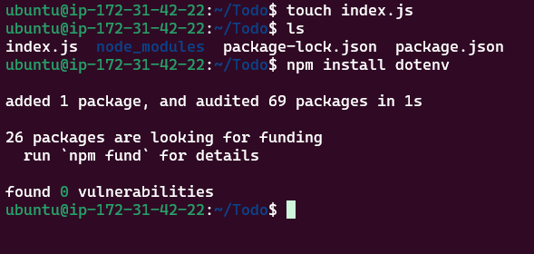
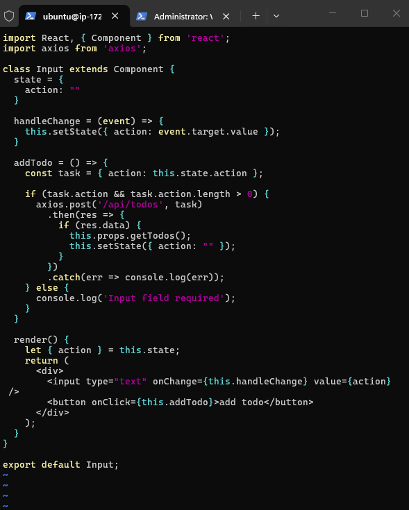
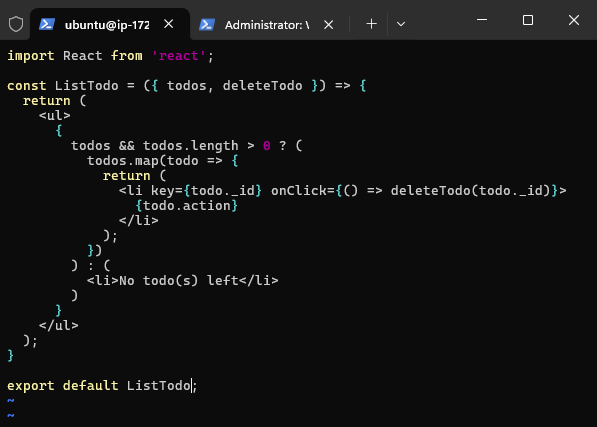
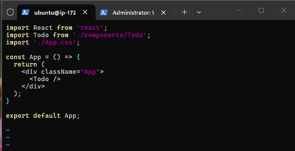
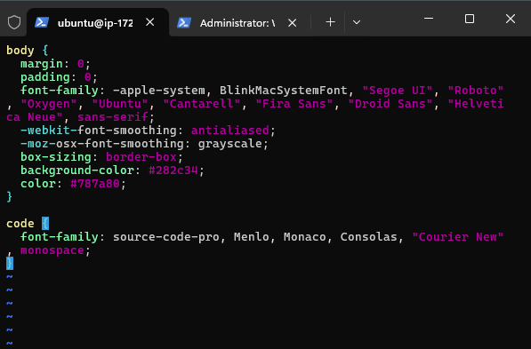

# MERN-WEB-STACK-PROJECT
## Introduction

This is a documentation that explain the implementation, setup, configuration of my MERN stack project (Todo Web App) in AWS cloud. MERN stack is one of the types of web stack that comprises of  MongoDB as the database for application data storage, ExpressJS as the server Web Application Framework for Node.js, ReactJS as the frontend framework for user interface components and NodeJS as Javascritt runtime Environment to run Javascript on a machine.

## PROJECT ARCHITECTURE


> AWS EC2 (Ubuntu 26.04) 
>    
> Backend Configuration
>
> Installing ExpressJS
> 
> Installing MongoDB
>
> MongoDB Database
>
> Testing backend Code without Frontend using RESTful API
>
> Frontend Creation
>
> Create React Componenets


# STEP 1 - PREREQUISITES
1. Login into AWS to create an Ec2 instance (LEMP SERVER) of t3.micro and Ubuntu Server 26.04 LTS (HVM), which was launched in eu-north 1b, using the command 
```
ssh -i <sshkey.pem> Ubuntu@ipaddress
```

2. Server update and upgrade
```
sudo apt update
sudo apt upgrade
```


# STEP 2 - Backend Configuration


1. Get the location of Node.js software from Ubuntu repositories
```
curl fsSL https://deb.nodesource.com/setup_18.x | sudo -E bash -
```


2. Install Node.js on the server
```
sudo apt-get install -y nodejs
```


3. check for node and npm version
```
node -v
npm -v
```


4. Create Todo directory
```
mkdir Todo
```


5. Initialize our project to create a new file in the Todo directory using npm init
```
npm init
```


# STEP 3 - Installing ExpressJs

1. Install Express using npm
```
npm install express
```


2.  create new index.js file in the Todo directory



3.  Run/server the server to check if it works
```
node index.js
```


4.  Add port 5000 to our ec2 inbound rule, so our server and ec2 instance can be able to connect


5.  Access server public IP through web browser
```
http://51.20.8.17:5000
```


6.  Create Routes folder tht will define various endpoints that the Todo app will depend on
   

7.  create new Api.js file, using the vim text editor, input the code for Api.js
```
touch Api.js
vi Api.js
```


# STEP 4 - Installing MongoDB

1. Install Mongodb
```
npm install mongoose
```


2.  create new folder for models, change to the models directory and create a file name Todo.js
```
mkdir models
cd models
touch Todo.js
```


3.  Open the newly created Todo.js file and input the code.
   

4.  change to routes directory and update the Api.js code
```
cd routes
vim api.js
```


# STEP 5 - MongoDB Database

1. Create account on mLab


2.  Add 0.0..0.0/0 to the the IP Access List to be able to serve data from anywhere
   
   

3.  Create MongoDB database and collection inside mLab
   

4.  Create .env file in the Todo directory and input the code using vim.
```
touch .env
vi .env
```


5.  Update the Index.js file to reflect the use of .env


6.  Start server
```
node index.js
```


# STEP 6 - Testing backend Code without Frontend using RESTful API

1. Create a GET request to API on 
```
http://51.20.8.17:5000/api/todos
```


2.  Create a POST task 


3.  Verify task using GET response


4.  Got to mLab and confirm if the task  added are showing in the database


5.  Delete task


# STEP 7 - Frontend Creation

We need to create a user interface for a web client to interact with the application via API

1.  Create frontend of the To-do app in the same root directory as the backend code.
```
npx create-react-app client
```


2.  installing the react app dependencies


3.  Open the Package.json file and input the code
```
vi package.json
```


4.  Configure proxy in package.json in the client directory
```
cd client
vi package.json
```


5.  run server app
```
npm run dev
```

The server was unable to run due to an error in the Package.json file. 
6.  Edit package.json file

After making correction/editing the package.json file, we can noe rerun the server app.

App running successfully on port 3000

7.  open port 3000 on the EC2 by adding it to the security group inbound rules


# STEP 8 - Create React Componenets

1.  Go to the src directory, create a newdirectory called components and create files named, Input.js, ListTodo.js and Todo.js.
```
cd src
mkdir components
touch Input.js ListTodo.js Todo.js
```


2.  Input the Input.js code
 

 3. Go to the clients folder and install Axios
```
cd ..
cd ..
npm install axios
```

   
4.  Input the ListTodo.js code


5.  Input the Todo.js code


6.  Make an adjustment to the App.js file in the the src folder   



7.  input the App.css code


8.  Input the Index.css code


9.  Go back to the root directory, which is the Todo directory and start the server
```
npm run dev
```


10. Confirm if the server runs using the web browser


11. Add more task

12. Verify on the mLab if the database stores correctly


# Conclusion
## Conclusion

Building this MERN application provided practical experience in developing, deploying, and managing a full-stack web application on AWS. It serves as a solid foundation for future projects involving cloud computing, DevOps, and scalable web application development.